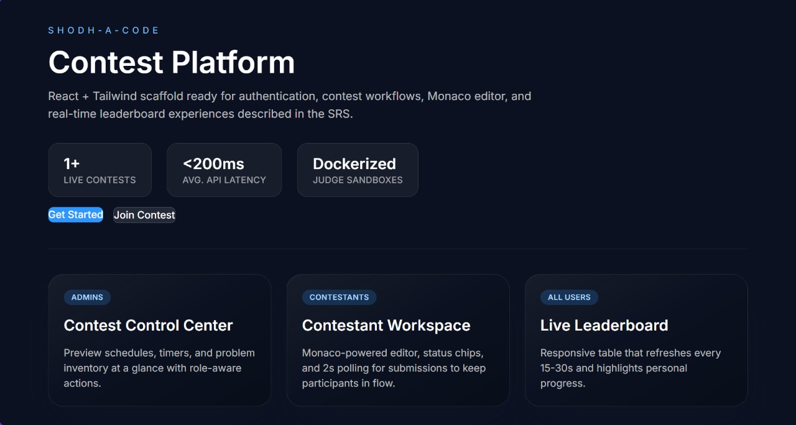

# Shodh-AI Contest Platform 

This repository hosts both the Spring Boot backend and the React/Vite frontend for the Shodh contest platform.  Together they provide:

- secure authentication backed by JWT
- contest, problem, and submission management
- a Docker-based judge service that runs user code against hidden test cases
- a modern React workspace with live status polling and leaderboards

---

## Live Demo 
You can [download the demo video (ZIP)](demo/shodh-ai-contest-plateform-recoding.zip) and view it locally.

---

## Project layout

```
.
├── backend   # Spring Boot API, judge service, persistence layer
└── frontend              # React/Vite frontend
```

---


## Tech stack

| Layer      | Tools / Libraries |
|------------|-------------------|
| Backend    | Java 21, Spring Boot 3, Spring Security, JPA/Hibernate, MySQL, Maven |
| Judging    | Docker, Eclipse Temurin JDK 21 runtime in `judge/Dockerfile` |
| Frontend   | React 19, Vite, Tailwind CSS, React Router |

---

## Prerequisites

- Java 21 (required for the backend build)
- Maven 3.9+
- Node.js 20+ and npm 10+
- Docker (used by the judge service)
- MySQL 8 (default connection string `jdbc:mysql://localhost:3306/shodh_ai_contests`)

> Update `shodh-ai-contest-backend/src/main/resources/application.properties` if your DB credentials differ.

---

## Backend setup

1. **Install dependencies & build**
   ```bash
   cd shodh-ai-contest-backend
   ./mvnw -DskipTests compile
   ```

2. **Configure database**
   - Ensure the `shodh_ai_contests` database exists.
   - Set `spring.datasource.username` and `spring.datasource.password`.
   - `spring.jpa.hibernate.ddl-auto=update` will create/adjust tables automatically.

3. **Start the API**
   ```bash
   ./mvnw spring-boot:run
   ```
   API defaults to `http://localhost:8080/api`.

4. **Judge prerequisites**
   - Build or pull the judge image referenced by `judge.image` (defaults to `shodh/judge:latest`).
   - Each problem must have at least one hidden test case in the `test_cases` table. Insert at least three per problem to mirror the UI.

---

## Frontend setup

1. **Install dependencies**
   ```bash
   cd shodh
   npm install
   ```

2. **Environment variables**
   - Copy `.env.example` to `.env`.
   - Set `VITE_API_BASE_URL` (usually `http://localhost:8080/api`).

3. **Run dev server**
   ```bash
   npm run dev
   ```
   Vite serves the app on `http://localhost:5173`.

---

## Key features

- **Authentication** – JWT-based login/register endpoints with Spring Security filters mirrored by the React Auth context.
- **Contest experience** – Problems, Monaco-style code editor, submission polling, and test case results displayed inline.
- **Judge service** – Compiles code inside a Docker sandbox, executes every hidden test, records per-case outcomes (`results_json`), and stores overall status.
- **Leaderboard** – Counts the number of *unique* problems solved per user per contest (multiple accepted submissions for the same problem do not increase score).

---

## Screenshots 
### DashBoard


### Login/Register


### Coding Environment


### Correct Solution


### Wrong Solution


screeshots/dashboard.jpg

## Developer tips

- **Test cases**: insert rows into `test_cases` with `problem_id`, `label`, `input_data`, `expected_output`, and optional `display_order`. The judge normalizes line endings and trims before comparing.
- **Timeouts**: adjust `judge.timeout` in `application.properties` if Docker cold starts exceed the default.
- **Docker STDIN**: the judge only runs runtime containers with `-i`; compile steps run non-interactively for reliability.
- **Frontend copy**: hero metrics and messaging live in `shodh/frontend/src/pages/Home.jsx`.
- **Leaderboard logic**: `LeaderboardController` filters submissions by contest and counts distinct problems solved.

---

## Useful commands

```bash
# Backend formatting & tests
cd shodh-ai-contest-backend
./mvnw fmt:format test

# Frontend linting
cd shodh
npm run lint
```

---


## Contributing

1. Create a feature branch.
2. Make sure both backend and frontend build without errors.
3. Provide sample test cases or DB seeds if the feature depends on them.
4. Submit a PR summarizing backend + frontend changes.

---

## Troubleshooting

- **Compilation failed (backend)**: confirm you are using Java 21.
- **Judge TLE on first run**: pull/pre-warm the Docker image; optionally raise `judge.timeout`.
- **Leaderboard not updating**: ensure submissions have a `user_id` (JWT-authenticated requests) and that problems belong to the selected contest.

Created By: Rahul Sharma
